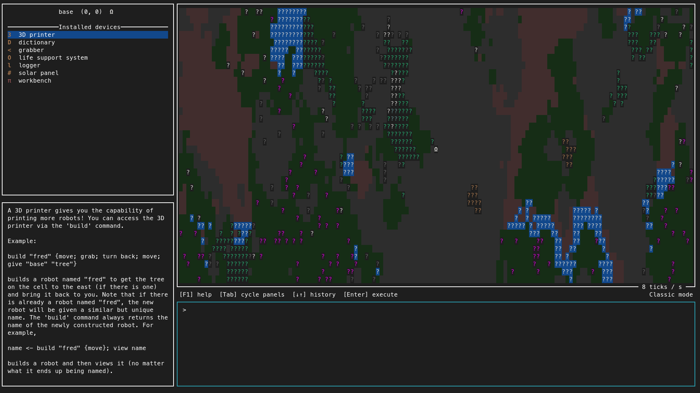
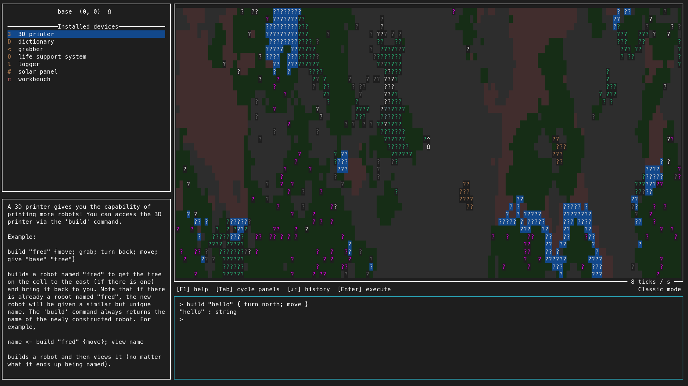
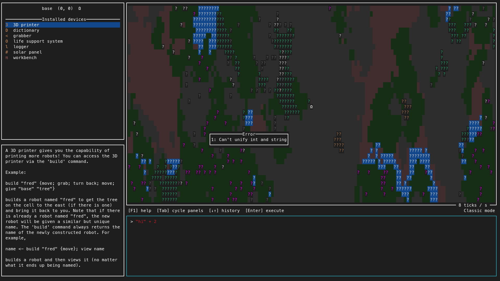
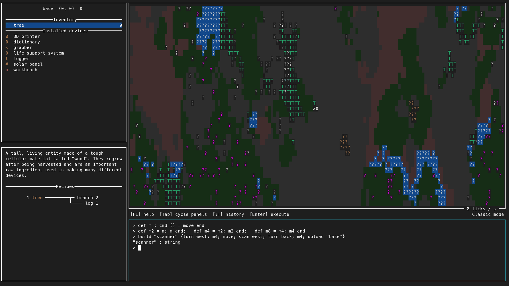
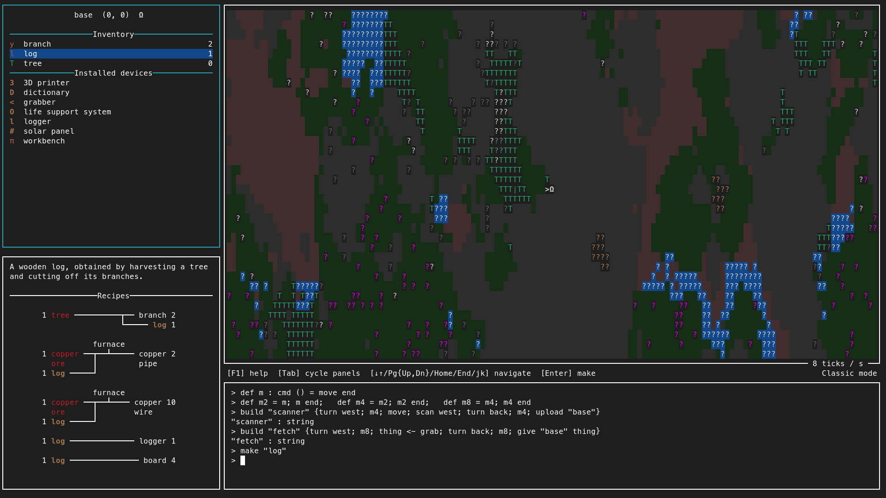
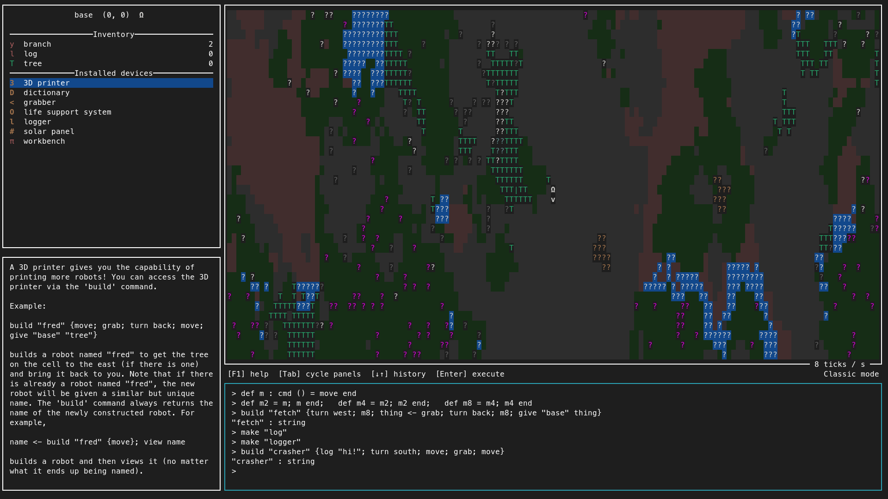
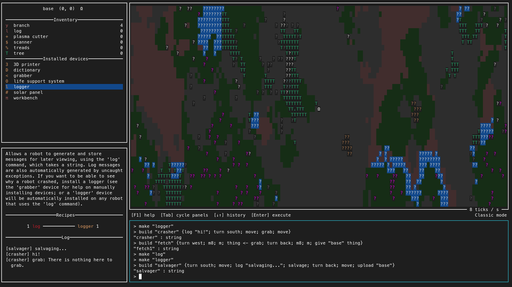

Swarm: The Tutorial
===================

Это небольшое руководство поможет вам освоиться в игре Swarm.
Swarm быстро меняется, так что руководство может не соответствовать
тому, как игра выглядит на данный момент (например, пользовательский
интерфейс может немного отличаться), но нашей целью является поддержка и обновление
руководство по мере обновления игры. Если вы обнаружили какие-то ошибки,
пожалуйста, [оставьте отчёт об ошибке](https://github.com/byorgey/swarm/issues/new/choose) 
или [откройте запрос на добавление изменений](https://github.com/byorgey/swarm/blob/main/CONTRIBUTING.md)!
Так или иначе, это руководство будет 
[заменено на внутриигровое обучение](https://github.com/byorgey/swarm/issues/25).

Рекомендуется использовать относительно большое окно терминала
(123x43, по возможности больше). С другой стороны, чем больше окно
тем больше библиотеке `vty` придётся затратить времени на отрисовку
кадра. Вы можете изменять размер окна прямо во время игры -
игра подстроится автоматически.

Предыстория
-------------

По стечению обстоятельств, вы совершили аварийную посадку на чужой планете!
~~Вы надеетесь~~ Ладно, на самом деле вы уже ни на что не надеетесь, 
но раз уж вы здесь, вам следует исследовать её.
Ваши датчики показывают, что атмосфера очень токсична, так что 
вам остаётся лишь отсиживаться на вашей роботизированной базе со втроенной
системой жизнеобеспечения. Тем не менее, у вас есть все материалы для того,
чтобы делать роботов, которые будут исследовать для вас! Для начала у вас 
есть только материалы для изготовления некоторых очень простых устройств,
которые дают вашим роботам такие способности, как перемещение, поворот,
захват предметов и интерпретация очень простых императивных программ.
Поскольку, вы используете своих роботов для добычи ресурсов, вы можете
создавать роботов с более широкими возможностями и более сложными
конструкциями языка программирования, которые позволят делать более 
сложных роботов, которые... Ну вы поняли.

Начало
---------------

Только запустив Swarm, вы увидите стартовый экран:



В окне просмотра мира вы видите стандартный Мир 0
и маленькая белая буква `Ω` в середине - это ваша база. Начните с
использования клавиши <kbd>Tab</kbd> для переключения между четырьмя панелями (командная строка,
информация, инвентарь и панель просмотра мира), и почитайте о различных устройствах,
установленных на вашей базе. Сначала нужно очень многое понять, поэтому
не стесняйтесь просто пробежаться глазами; В этом руководстве будет детально
рассказано об использовании ваших устройств.

Создание вашего первого робота
-------------------------

Практически единственное, что вы можете делать - это создавать роботов.  
Давайте сделаем одного! Переключитесь в командную строку (или нажмите <kbd>Meta</kbd>+<kbd>R</kbd>) и введите
```
build "hello" {turn north; move}
```
и нажмите Enter. Вы увидите, как появится робот и сделает шаг на север
прежде чем остановиться. Это должно выглядеть так:



Так же, вы можете видеть, что в командной строке появилась строчка
```
"hello" : string
```
что является результатом вашей команды вместе с ее типом. Команда `build`
всегда возвращает строку с именем созданного робота;
она может отличаться, если уже был создан робот с таким именем.

Точка с запятой используется для объединения нескольких комманд в одну,
то есть, если `c1` и `c2` являются двумя командами, то `c1 ; c2` будет уже одной
командой, где сначала выполнится `c1`, а затем `c2`. Фигурные скобки выглядят
причудливо, но на самом деле вы можете использовать и круглые скобки, они тоже
сработают. В конечном счете, команда сборки - это просто функция, которая
принимает два аргумента: строку и команду. (Тест: если бы мы убрали фигурные
скобки вокруг команд `move`, как в `build "hello"
move;move;move;move`, что бы произошло? Подсказка: применение
функции имеет более высокий приоритет, чем точка с запятой. Попробуйте и увидите!)

Типы
-----

Мы можем увидеть тип команды `build` (да и вообще любой команды)
просто написав её в строке, не нажимая `Enter`. Каждый раз,
когда вы вводите в командную строку выражение, она анализирует его
и показывает тип в верхнем правом углу, вот так:


В данном случае она показывает тип команды `build`
```
∀ a0. string -> cmd a0 -> cmd string
```
который показывает, что `build` принимает два аргумента - `string`, 
и команду, которая возвращает значение любого типа, и возвращает команду, 
результатом которой является `string`. Каждая команда возвращает значение,
хотя многие команды могут возвращать значение нулевого типа `()`. К примеру, 
если вы напишете `move`, вы увидите тип `cmd ()`,
так как `move` не возвращает никакого значимого результата после выполнения.

Давайте попробуем намеренно ввести что-то, что сломает проверку типов.
Введите следующее в командной строке:
```
"hi" + 2
```
Очевидно, что это абсрд, и вы можете видеть, как ввод отображается красным
цветом, а в верхнем правом углу не отображается тип выражения, что значит, что
произошла какая-то ошибка (либо ошибка распознавания, либо ошибка вывода типа).
Если вы хотите узнать, в чём заключается ошибка, просто нажмите `Enter`: 
в диалоговом окне вы увидите подробную информацию об ошибке.



Чтобы закрыть диалоговое окно, просто нажмите <kbd>Esc</kbd>.

Кое-что, что вы пока ещё не можете
--------------------------

Попробуйте ввести это в командную строку:
```
build "nope" {let m : cmd () = move in m;m;m}
```
Информационная панель должна автоматически переключиться на логгер,
с сообщением об ошибке внизу, в котором говорится что-то вроде:
```
build: this would require installing devices you don't have:
  dictionary
```
Это говорит вам о том, что чтобы создать робота который может
запустить эту программу, вам нужно установить в него устройство `dictionary`, 
но в вашем инвентаре его нет.  (Вы имеете установленное `dictionary` в вашем 
базовом роботе, но вы не можете снять его и поместить в другого робота.
Вам придётся найти способ сделать ещё.)

Создание определений
--------------------

Очень утомительно писать каждый шаг
`move;move;move;move;...`. Поскольку в вашей базе уже есть `dictionary`, 
давайте создадим несколько определений, которые облегчат нам жизнь.
Для начала, введите следующее:
```
def m : cmd () = move end
```

Аннотация типа `: cmd ()` для `m` не обязательна; в этой ситуации 
игра легко бы вывела тип `m` сама, даже если мы просто написали
`def m = ...` (хотя в некоторых ситуациях явное указание типа необходимо).
<sup>Фигурные скобки на самом деле тоже не обязательны. `end` нужен для того, чтобы
было понятно, где находится конец выражения. Это необходимо, особенно когда
несколько опеределений записаны последовательно (например, в файле с определениями)</sup>.

Попробуйте это:
```
def m2 = m; m end;   def m4 = m2; m2 end;   def m8 = m4; m4 end
```

Здорово, теперь мы можем использовать `move` четыре и восемь раз,
Давайте попробуем:
```
 build "runner" { turn west; m4; m }
```
Этот робот пойдёт до зелёной массы на западе.

(Сейчас вы можете задаться вопросом, а можно ли создать функцию, которая
принимает число в качестве входных данных и продвигает робота на столько 
шагов вперёд. Это, конечно, возможно, но сейчас ваши роботы не смогли бы
это выполнить)

Получение результата команды
-------------------------------

Результат выполнения комманды может быть присвоен переменной с помощью
стрелки влево, то есть:
```
var <- command; ... ещё команды, которые могут ссылаться на var ...
```
(Да, это похоже на `do`-нотацию в Haskell; и да, `cmd` - это
монада, подобная монаде `IO` в Haskell. Но если для вас это ничего не
значит, не расстраивайтесь!) Давайте сделаем ещё одного робота, назовём
его `"runner"`. Он будет переименован во что-то другое, чтобы имена
не конфликтовали, но мы можем записать его имя в переменную, используя
приведённый выше синтаксис. Затем мы можем использовать команду
`view` чтобы сосредоточиться на нём, а не на базе:
```
r <- build "runner" { turn west; m4; m }; view r
```
Обратите внимание, что `base` использует команду `view r` как только завершается
команда `build`, то есть в то же время, что робот начинает выполнять программу.  
Итак, мы можем наблюдать за новым роботом, когда он занимается своими делами.
После этого вид должен выглядеть примерно так:


Обзор карты центрирован на `runner1` а не на нашей базе, и 
верхняя панель покпзвает инвенарь и установленные устройства `runner`
а не нашей базы. (Однако, командная строка выполняет команды на базе)
Чтобы вернуться к базе, введите `view "base"` в консоль, или выберите панель
"Мир"(используя <kbd>Tab</kbd> или <kbd>Meta</kbd>+<kbd>W</kbd>) и нажмите <kbd>C</kbd>.

Исследование
---------

Что это за хлам валяется повсюду? Давайте знаем! Когда вы создаёте
робота, он имеет только устройство `scanner`, которые вы, наверное 
заметили в инвентаре `runner1`.  Вы можете сканировать предметы в мире
чтобы получать о них информацию, а затем загружать её на вашу базу.

Давайте построим робота, чтобы узнать об этих зелёных `?` на западе:
```
build "s" {turn west; m4; move; scan west; turn back; m4; upload "base" }
```
Команда `turn` Поворачивает робота. Она принимает направление в
качестве аргумента, которые могут быть заданы как абсолютным
направлением (`north`, `south`, `east`, или `west`), так и
относительным (`forward`, `back`, `left`, `right`, или `down`).

Обратите внимание, что роботу на самом деле не нужно было становиться 
прямо на ячейку `T` чтобы изучить её, так как он мог просто выполнить `scan west`
для того чтобы отсканировать ячейку на западе (вы также можете выполнить
`scan down`, чтобы отсканировать ячейку под роботом). Ну, и команда `upload`
так же может быть выполнена на соседней с базой ячейкой.

Когда робот вернётся, у вас появится новая строка в инвентаре:



Очевидно, что это деревья! Хотя у вас ещё и нету деревьев,
вы можете открыть инвентарь и почитать в нём о них.
В левом нижнем углу вы увидите описание деревьев и некоторые
рецепты крафта с их участием. Существует только один рецепт,
показывающий, что оно нужно для изготовления двух палок и бревна.

Добыча ресурсов
----------------------

Эти деревья могут нам пригодиться. Давайте принесём одно на базу!
```
build "fetch" {turn west; m8; thing <- grab; turn back; m8; give "base" thing }
```
Можно заметить, что команда `grab` возвращает название захваченного,
предмета, что очень полезно при захвате чего-нибудь неизвестного.
(В этом случае мы могли бы написать что-то вроде `...; grab; ...; give "base" "tree"; ...`.)

Вы должны увидеть, как робот направляется на запад, хватает дерево и
возвращается на базу. Если всё сработало правильно, после того, как
робот выполнит команду `give`, число с записью `tree` должно измениться
с 0 до 1. Обратите внимание, что в этом случае мы могли бы пропустить этап
сканирования и просто заставили бы робота схватить дерево и принести нам;
мы бы узнали, что это, когда оно появилось бы в нашем инвентаре.
Но `scan` будет полезен для вещей, которые нельзя подобрать; Вы также можете
создать робота, который будет сканировать сразу несколько вещей перед тем, как
занести информацию на базу.

Поскольку на вашей базе установлен `workbench`, вы можете использовать
команду `make` чтобы собрать что-то. Просто напишите название вещи, которую
вы хотели бы сделать, и система автоматически выберет рецепт,
который сделает то, что вы просили, и для которого у вас есть все
необходимые материалы. Сейчас, мы можем запросить создание `log` или `branch`;
не важно, что именно, в любом случае мы получим один и тот же результат.

Так как команда `make` принимает значение типа `string`,
`"log"` должен быть заключён в двойные кавычки (иначе это будет восприниматься
как переменная). Теперь в вашем инвентаре есть две палки и бревно. 
Посмотрите, что можно сделать из них!



К этому времени вы можете заметить, что дерево успело вырасти снова 
(Насколько оно выросло, зависит от того, сколько вам потребовалось времени
чтобы прочитать эту часть, ну и от генератора случайных чисел). Некоторые
предметы в игре вырастут снова после того, как их собрали, некоторые - нет.

Отладка и очистка
-------------------------

Возможно, вы заметили, что роботы после завершения своих программ,
просто зависают на одном месте. Различные условия
могут привести робота к сбою, что, в свою очередь, приведёт к его зависанию.
Давайте посмотрим, как очистить оставшихся роботов или просто узнать, 
что именно пошло не так.

Когда программа робота падает, она оставляет сообщение в лог
которое потом может использоваться в диагностике, но только если у робота
есть устройство `logger`. Иначе, сообщение об ошибке просто будет потеряно.
Давайте сделаем робота с устройством `logger` и заставим его дать сбой,
чтобы посмотреть, как это работает.

Для начала, сделаем `logger`. `logger` может быть сделан из одного бревна(log),
которое уже есть в нашем ингвентаре. Просто введите `make "logger"`.


Как установить в робота `logger`? Просто используйте команду `log` в нём;
команда `build` сама проанализирует программу и установит нужные для неё устройства.
(Также, возможно устанавливать устройства командой `install`.) 
Давайте попробуем:
```
build "crasher" {log "hi!"; turn south; move; grab; move}
```
Теперь мир должен выглядеть примерно так, как показано на скриншоте ниже.
Обратите внимание, что `logger` исчез из вашего инвентаря - он был автоматически
установлен на робота. Также, робот сделал только один шаг ня юг, хотя
должен был сделать два! Что пошло не так?



Единственное, что мы можем сделать сейчас, так это использовать 
`view "crasher"`. Однако, в будущих версиях игры будет несколько
сложнее использовать команду`view`, и что, если мы просто забыли или не знали
имя разбившегося робота? К счастью, есть ещё кое-что, что мы можем сделать:
послать другого робота, чтобы разобрать сломанного.

Команда `salvage` может быть использована любым роботом с устройством
`plasma cutter`, который является одним из устройств, установленных на каждом 
новом роботе по умолчанию. она не принимает аргументов, она просто ищет
неработающего робота на той же клетке, и если он есть, робот просто
разбирает его, забрав себе все предметы инвентаря сломанного робота.
Он также компирует лог сломанного робота себе, если у него есть нужное
устройство. Если же на ячейке рядом нет неработающего робота, то команда ничего не делает.

Давайте разберём робота, используя вышеприведённый код. Нам нужно
убедиться, что у разбирающего робота есть `logger`, чтобы он смог
скопировать журнал сломанного робота, Поэтому нам нужно принести ещё
одно дерево на базу, чтобы сделать его.
```
build "fetch" {turn west; m8; m; thing <- grab; turn back; m8; m; give "base" thing}
make "log"
make "logger"
build "salvager" {turn south; move; log "salvaging..."; salvage; turn back; move; upload "base"}
```
Мир должен выглядеть примерно так:



Как вы видите, в лог базы добавились записи с робота `crasher`!
они были скопированы с лога `salvager`, когда была выполнена команда `upload`.
Можно заметить сообщение `hi!`, и причина поломки робота:
Он попытался выполнить команду `grab` там, где нечего подбирать

Загрузка определений с файла
-------------------------------

И, напоследок: также возможно загружать код из файлов. 
Просто напишите `run("filename")` и содержимое файла выполнится,
как если бы вы напечатали его содержание в консоль. Например, вместо того,
чтобы писать определения в консоли, вы можете последовательно их записать
в файл через точку с запятой (так как пробелы игнорируются, вы можете писать
код в таком формате, как вам хочется). Вы просто можете отредактирвоать файл, 
написать `run` каждый раз, когда вы хотите поменять определения.
В конце концов, появится способ сохранять код в игре, но пока что это лучше,
чем ничего.

Генерация мира
----------------

Если вам не нравится сгенерированный мир, вы можете сгенерировать
ещё один, совершенно другой мир.

```bash
$ swarm --seed $RANDOM
```

Вы можете указать seed мира, приводящий к радикально иным
начальным условиям. Вы можете начать рядом с медным участком,
между озерами или посреди равнины. В любом случае, вы основали
свою базу в тени того, что, как вы предполагаете, является деревом,
и теперь можете отправлять роботов на разведку!


Творческий режим
-------------

На данный момент существует секретный способ включения творческого режима.
В классическом режиме, набор команд, которые могут выполнять роботы
ограничен установленными на них устройтвами. В творческом режиме
вы можете делать всё что угодно, и создавать вещи прямо из ничего, используя
команду `create`. Также, там не будут скрыты неисследованные предметы. Чтобы переключиться в творческий режим, переключитесь в панель
мира и нажмите клавишу <kbd>m</kbd>.

Приятной игры!
